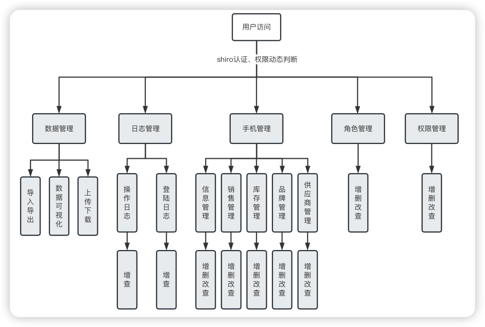
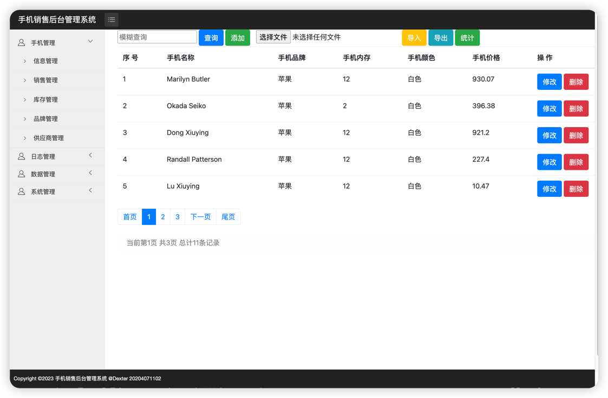
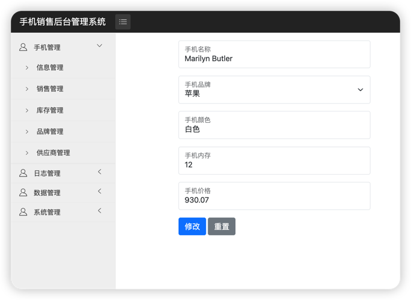

# phone-manage-system(手机销售后台管理系统)

- 开发环境：MacOS
- 开发工具：IntelliJ IDEA
- Java版本：JDK 1.8
- 依赖管理：Maven
- 服务器：Tomcat 9.0.74
- 端口号：8080
- 数据库：MySQL 8.0.31
- 技术栈： Spring + SpringMVC + Mybatis-Plus + Thymeleaf + Shiro  

### 一、项目介绍
SSM（Spring+SpringMVC+MyBatis）框架是一种常用的Java Web开发框架，而Shiro是一种安全框架，用于身份认证和授权。在我的课程设计中，我使用了SSM+Shiro框架进行了一个基于Web的管理系统的设计与开发。在这个过程中，我深刻地体会到了SSM+Shiro框架的优点，并且也遇到了一些挑战，在设计SSM+Shiro管理系统的过程中，我首先进行了数据库设计，然后使用MyBatis框架编写了数据访问层（DAO），接着使用Spring框架进行了业务逻辑层（Service）的设计和开发。在这个过程中，我使用了Shiro框架进行用户身份认证和授权，保证了系统的安全性。在技术选型方面，我选择了SSM+Shiro框架，它们是目前比较成熟的Java Web开发框架和安全框架，具有较高的稳定性和可靠性。同时，我也使用了MySQL数据库进行数据存储，使用了Redis缓存进行数据缓存，以提高系统的性能和稳定性。在功能实现方面，我实现了业务管理、用户管理、角色管理、权限管理、日志管理等基本功能，并且通过Shiro框架实现了用户登录、权限判断等功能。同时，我也实现了一些高级功能，例如数据的导入导出、分析展示、权限管理的树形结构、角色用户的一对多、多对多的管理等。

### 二、系统功能

### 三、数据库设计

### 四、系统流程

### 五、系统截图

